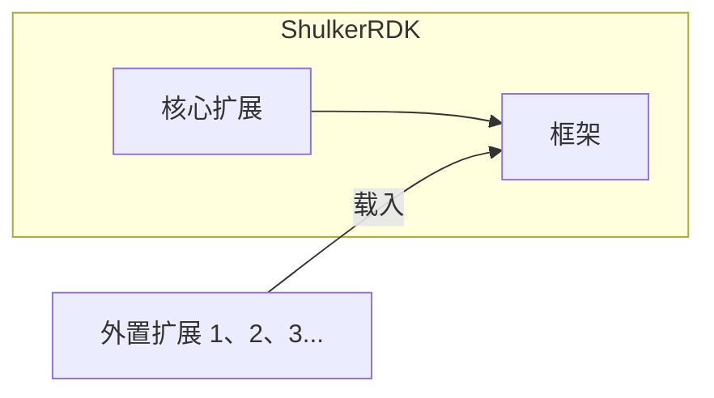

# 交互与架构
## 关于架构...
在开始之前, 让我们先来了解一下 ShulkerRDK 的架构, 这对您之后的使用有一定帮助



如你所见, 在 ShulkerRDK 中, 扩展扮演着重要的角色, 主程序内置的功能也由和扩展几乎一样的接口实现 (核心扩展), 并且许多高级功能都由第一方外置扩展提供来减小主程序体积

`框架` 提供了一个「壳」, 而 `扩展` (包含 `核心扩展`) 则是填充这个壳的内容物

`扩展` 为 `框架` 提供指令, Levitate方法, 启动参数以供调用

## 开始交互
好的, 现在请从 [GitHub Release](https://github.com/LiPolymer/ShulkerRDK/releases) 或 [GitLab Release](https://gitlab.com/LiPolymer/ShulkerRDK/-/releases) 下载适合您 ShulkerRDK 主程序文件并放置到一个空文件夹内运行

跟随指引初始化项目并进入交互模式后, 您可以输入您对 ShulkerRDK 的第一条指令:
```
help c
```
这将会列出当前所有可用的指令

现在让我们在 `./shulker` 下创建一个 `tasks` 文件夹, 并在其内创建一个空文件 `test.lvt`

这将会是您的第一个 Levitate Task 脚本

现在请打开这个文件, 输入:
```
echo "Hello World!"
```

> [!TIP]
> 您可能注意到 `Hello World!` 被一对双引号包裹
>
> 这和 ShulkerRDK 如何解析 指令/方法 有关
> 
> 通常, 参数以空格分割, 不过双引号内包裹的内容会被作为一个参数来解析
> 
> 如果希望输出 `HelloWorld!` , 那么 `echo HelloWorld!` 和 `echo "HelloWorld!"` 的效果是相同的
>
> 有趣的是, 您也可以使用 `"echo" HelloWorld!`, 不过为什么要这样办呢 (雾

保存, 在交互模式下运行指令:
```
task test
```
您会看到您的脚本已被执行