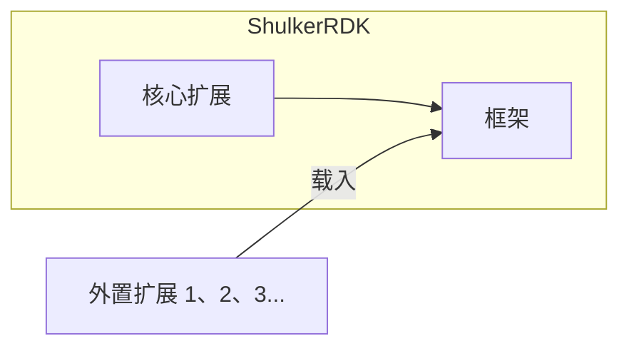

# 交互与架构
## 关于架构...
在开始之前, 让我们先来了解一下 ShulkerRDK 的架构, 这对您之后的使用有一定帮助


```mermaid
flowchart LR
  subgraph ShulkerRDK
  ce[核心扩展]-->fr[框架]
  end
  ee[外置扩展 1、2、3...]-->|载入|fr[框架]
```

如你所见, 在 ShulkerRDK 中, 扩展扮演着重要的角色, 主程序内置的功能也由和扩展几乎一样的接口实现 (核心扩展), 并且许多高级功能都由第一方外置扩展提供来减小主程序体积

`框架` 提供了一个「壳」, 而 `扩展` (包含 `核心扩展`) 则是填充这个壳的内容物

`扩展` 为 `框架` 提供指令, Levitate方法, 启动参数以供调用

## 开始交互
好的, 现在请从 [GitHub Release](https://github.com/LiPolymer/ShulkerRDK/releases) 或 [GitLab Release](https://gitlab.com/LiPolymer/ShulkerRDK/-/releases) 下载适合您 ShulkerRDK 主程序文件并放置到一个空文件夹内运行

跟随指引初始化项目并进入交互模式后, 您可以输入您对 ShulkerRDK 的第一条指令:
```
help c
```
这将会列出当前所有可用的指令

现在让我们在 `./shulker` 下创建一个 `tasks` 文件夹, 并在其内创建一个空文件 `test.lvt`

这将会是您的第一个 Levitate Task 脚本

现在请打开这个文件, 输入:
```
echo "Hello World!"
```

> [!TIP]
> 您可能注意到 `Hello World!` 被一对双引号包裹
>
> 这和 ShulkerRDK 如何解析 指令/方法 有关
> 
> 通常, 参数以空格分割, 不过双引号内包裹的内容会被作为一个参数来解析
> 
> 如果希望输出 `HelloWorld!` , 那么 `echo HelloWorld!` 和 `echo "HelloWorld!"` 的效果是相同的
>
> 有趣的是, 您也可以使用 `"echo" HelloWorld!`, 不过为什么要这样办呢 (雾

保存, 在交互模式下运行指令:
```
task test
```
您会看到您的脚本已被执行


## 三种交互方式

现在您已经体验了运行一个 Levitate 脚本, 让我们稍微系统地了解一下 ShulkerRDK 提供的所有交互方式

### 交互模式

这是最直观的交互方式 — 运行 ShulkerRDK 后进入一个类似命令行的环境, 提示符显示为:
```
>
```

您可以在这里输入任何可用的指令, 按回车即可执行

这种模式适合日常开发时的项目管理、调试和探索性操作

### 启动参数模式

如果您不想进入交互界面, 可以直接通过命令行参数来执行操作:

```bash
./srdk build
./srdk c proj i
./srdk c task publish
```

这种模式适合在 CI/CD 管道、批处理脚本或任何需要自动化调用的场景中使用

### Levitate Task 脚本

正如您刚才看到的, ShulkerRDK 允许您将一系列操作写入 `.lvt` 脚本文件中, 通过 `task` 指令或启动参数来执行

这种模式适合定义可复用的构建流程、发布流程或其他客制化工作流


## 接下来...

现在您已经了解了 ShulkerRDK 的基本架构和交互方式, 是时候深入探索各项功能了

在接下来的章节中, 我们将分别介绍:

- [指令系统](core/commands.md) — 交互模式下可用的全部指令, 包括项目管理、版本控制、环境变量和网络链接文件等
- [Levitate 方法](core/levitate.md) — Levitate Task 脚本中可使用的 DSL 方法, 用于编写自动化工作流
- [启动行动](core/startupActions.md) — 通过命令行参数直接触发的操作, 适合自动化调用

让我们从最常用的指令系统开始吧
